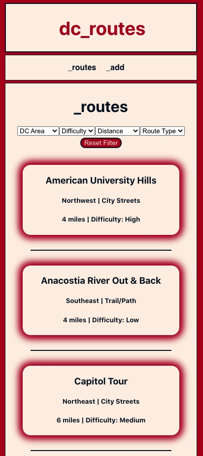
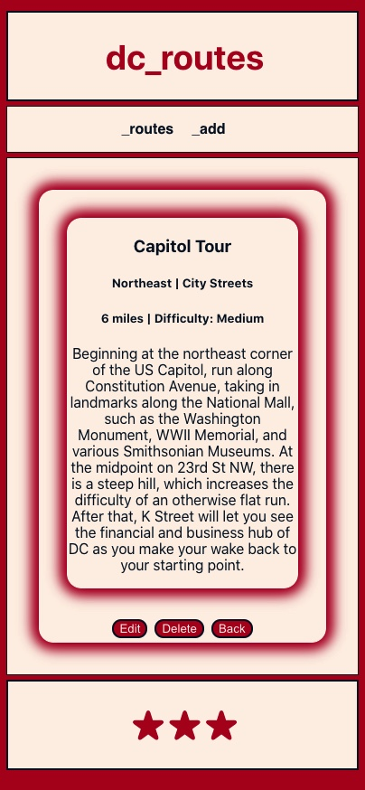

# DC Routes

This app offers various running routes in the Washington, DC, area. Choose which part of DC you want to run in, how far you want to run, or what type of route you want to run. You can also add your own routes to the list to help expand our database of DC running routes.

## [DC Routes](https://dc-routes-client.vercel.app/)

In order to meet the basic requirements of the Thinkful capstone for which this app was built, certain functionalities are not yet available. For now, route information is limited to descriptions of the route and its directions. In future versions of this app, functionality will include third-party API usage for display maps of the routes, as well as user authentication so that users can create profiles and keep a list of their favorite running routes. Additionally, only authenticated users will be able to edit or delete routes, and only routes which they have created.

This is the client side of the app, which was built with React. Context is used to manage state throughout. Knex connects this client with its server. Smoke testing and snapshot testing are also used inside the app.

This is a fullstack app using Heroku for server hosting and Vercel for client hosting.

[Heroku](https://heroku.com) 

[Vercel](https://vercel.com) 

Please see the link below for DC Routes Server repository.

### [DC Routes Server](https://github.com/mkdnt/dc-routes-server)
